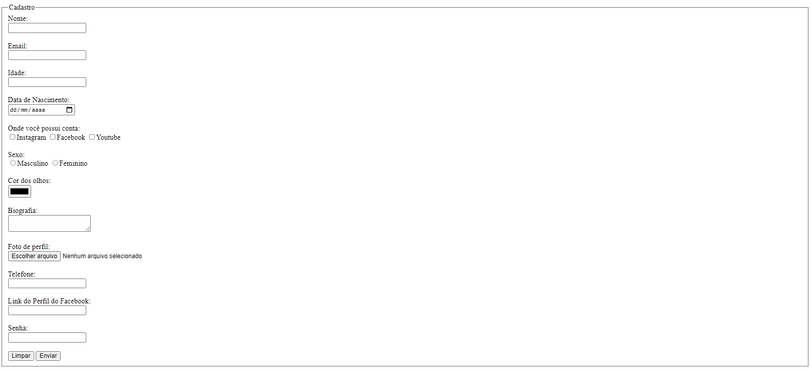

# HTML form

> Simple design of an HTML-only form.

### Adjustments and improvements

The project is complete!

## 🤝 Contributors

We thank the following people who contributed to this project:

<table>
  <tr>
    <td align="center">
      <a href="#">
         
        
          <b>Bruno Luis</b>
        
      </a>
    </td>

